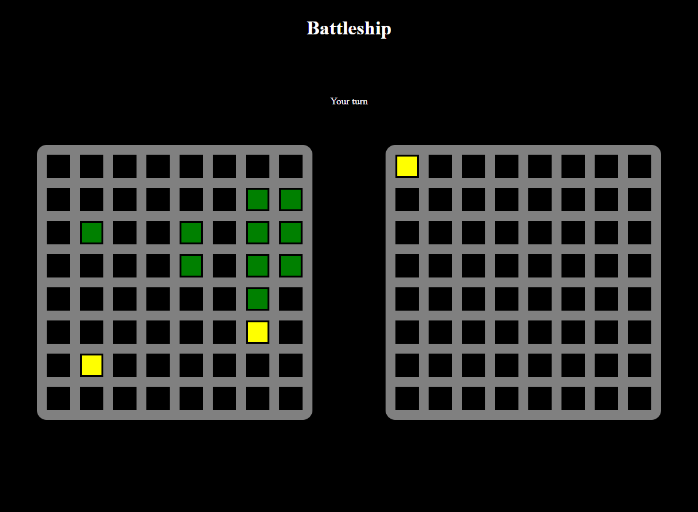

<a id="readme-top"></a>

<div align="center">

[![Contributors][contributors-shield]](https://github.com/Cemus/battleship/graphs/contributors)
[![Forks][forks-shield]](https://github.com/Cemus/battleship/network/members)
[![Stargazers][stars-shield]](https://github.com/Cemus/battleship/stargazers)
[![Issues][issues-shield]](https://github.com/Cemus/battleship/issues)
[![License][license-shield]](https://github.com/Cemus/battleship/blob/main/LICENSE)
[![LinkedIn][linkedin-shield]](https://www.linkedin.com/in/kevin-lionnet/)

</div>

<br />
<div align="center">
<a href='https://github.com/Cemus/battleship'>

</a>

<h3 align='center'>Bataille Navale</h3>

<p align="center">
Jeu de bataille navale minimaliste contre l'ordinateur.
<br />
<a href='https://cemus.github.io/battleship/'><strong>Voir le site »</strong></a>
<br />
<br />
<a href=https://github.com/Cemus/battleship/issues/new?labels=bug&template=bug-report---.md>Signaler un bug</a>
&middot;
<a href=https://github.com/Cemus/battleship/issues/new?labels=enhancement&template=feature-request---.md>Demander une fonctionnalité</a>
</p>
</div>

<details>
<summary>Sommaire</summary>
<ol>
<li>
<a href='#à-propos-du-projet'>À propos du projet</a>
<ul>
<li><a href=#technologies-utilisées>Technologies utilisées</a></li>
</ul>
</li>
<li>
<a href='#installation-locale'>Installation locale</a>
<ul>
<li><a href='#prérequis'>Prérequis</a></li>
<li><a href=#installation>Installation</a></li>
</ul>
</li>
<li><a href=#liens-utiles>Liens utiles</a></li>
</ol>
</details>

## À propos du projet

[](https://github.com/Cemus/battleship)

## Features
- Selection de l'emplacement de ses navires en début de partie
- Intelligence artificielle qui joue ses coups en fonction des résultats de ses coups précédents

<p align='right'>(<a href='#readme-top'>Retour en haut</a>)</p>

## Technologies utilisées


<p align='right'>(<a href='#readme-top'>Retour en haut</a>)</p>

## Installation locale
Pour installer ce projet localement, il faut suivre ces étapes simples.

### Prérequis
Installer npm
```sh
npm install npm@latest -g
```

### Installation
1. Cloner le dépôt
```sh
git clone https://github.com/Cemus/battleship.git
```
2. Installer les dépendances NPM
```sh
npm install
```
3. Lancer le serveur de développement
```js
npm run dev
```


<p align='right'>(<a href='#readme-top'>Retour en haut</a>)</p>

## Liens utiles
[Bataille Navale](https://cemus.github.io/battleship/)

[Mon GitHub](https://github.com/Cemus)

<p align='right'>(<a href='#readme-top'>Retour en haut</a>)</p>

[contributors-shield]: https://img.shields.io/github/contributors/Cemus/battleship.svg?style=for-the-badge
[contributors-url]: https://github.com/Cemus/battleship/graphs/contributors
[forks-shield]: https://img.shields.io/github/forks/Cemus/battleship.svg?style=for-the-badge
[forks-url]: https://github.com/Cemus/battleship/network/members
[stars-shield]: https://img.shields.io/github/stars/Cemus/battleship.svg?style=for-the-badge
[stars-url]: https://github.com/Cemus/battleship/stargazers
[issues-shield]: https://img.shields.io/github/issues/Cemus/battleship.svg?style=for-the-badge
[issues-url]: https://github.com/Cemus/battleship/issues
[license-shield]: https://img.shields.io/github/license/Cemus/battleship?style=for-the-badge
[license-url]: https://github.com/Cemus/battleship/blob/main/LICENSE
[linkedin-shield]: https://img.shields.io/badge/-LinkedIn-black.svg?style=for-the-badge&logo=linkedin&colorB=555
